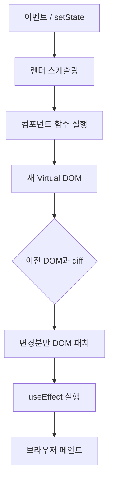

# 렌더링 흐름

React에서 **렌더링**이란, 컴포넌트 함수를 실행해 **어떤 UI를 그릴지 계산**하는 과정이다.  
이 계산 결과를 DOM에 반영하는 것을 **커밋(commit)** 이라고 부른다.

---

## 전체 흐름 한눈에

```text
1. 트리거 (State/Props 변경, 부모 리렌더 등)
      ↓
2. 렌더 단계 — 컴포넌트 함수 실행 → Virtual DOM 트리 생성
      ↓
3. Reconciliation — 이전 Virtual DOM과 비교 (diff)
      ↓
4. 커밋 단계 — 변경된 DOM 노드만 실제 DOM에 반영
```

---

## 1. 렌더가 일어나는 경우

| 트리거 | 예시 |
| --- | --- |
| **최초 마운트** | `root.render(<App />)` |
| **State 변경** | `setCount(1)` |
| **Props 변경** | 부모가 새 Props 전달 |
| **부모 리렌더** | 부모가 다시 렌더되면 자식도 기본적으로 다시 렌더 |
| **Context 값 변경** | Provider의 value 변경 |

```jsx
function Parent() {
  const [n, setN] = useState(0);
  return (
    <>
      <button onClick={() => setN(n + 1)}>+</button>
      <Child label={n} />  {/* n 바뀔 때 Child도 리렌더 */}
    </>
  );
}
```

---

## 2. 렌더 단계 (Render Phase)

- 각 컴포넌트 함수가 **다시 호출**된다
- return 값(JSX)으로 **새 Virtual DOM 트리**를 만든다
- 이 단계는 **중단 가능**하고, React가 우선순위를 조절할 수 있다 (Concurrent Features)

```jsx
function Profile({ user }) {
  console.log('Profile 렌더'); // State/Props 변경 시마다 실행
  return <h1>{user.name}</h1>;
}
```

### ⭐ 렌더 ≠ 화면에 그리기

렌더는 **계산**이고, DOM 반영은 그다음 **커밋** 단계에서 일어난다.

---

## 3. Reconciliation (조정)

React는 **이전 Virtual DOM**과 **새 Virtual DOM**을 비교해 **최소한의 변경**만 실제 DOM에 적용한다.

### diff 알고리즘의 전제

1. **서로 다른 타입**의 요소 → 기존 트리를 버리고 새로 만든다
2. **같은 타입** → 속성만 업데이트하고 자식은 재귀적으로 비교
3. **리스트** → `key`로 항목을 매칭

```jsx
// 타입이 바뀌면 내부 State가 초기화될 수 있음
{isLogin ? <Dashboard /> : <LoginForm />}
// Dashboard ↔ LoginForm 전환 시 각각 새로 마운트
```

### key의 역할

```jsx
// key 없이 중간 항목 삭제 → 뒤 항목들이 잘못 재사용될 수 있음
{todos.map((todo) => (
  <TodoItem key={todo.id} todo={todo} />
))}
```

---

## 4. 커밋 단계 (Commit Phase)

- 실제 DOM 업데이트
- `useEffect` 등 **부수 효과(side effect)** 실행
- 브라우저가 화면을 **페인트**

렌더 단계와 달리 커밋은 **동기적**이고 **중단되지 않는다**.

---

## 컴포넌트 트리와 렌더 범위

State가 바뀐 컴포넌트부터 **아래 자식 트리**가 렌더 대상이 된다.

```text
App (State 변경 ✓)
├── Header          → 리렌더
├── Sidebar         → 리렌더
└── Main
    └── PostList    → 리렌더
        └── PostItem → 리렌더
```

형제 컴포넌트의 State가 바뀌어도 **다른 형제는** 리렌더되지 않는다.

```text
App
├── CounterA (count 변경) → A만 리렌더
└── CounterB              → 영향 없음
```

---

## 리렌더를 줄이는 방법 (개요)

| 방법 | 설명 |
| --- | --- |
| `React.memo` | Props가 같으면 컴포넌트 리렌더 스킵 |
| `useMemo` | 계산 결과 메모이제이션 |
| `useCallback` | 함수 참조 유지 |
| State 위치 조정 | 자주 바뀌는 State를 트리 아래쪽에 |

```jsx
const MemoizedChild = React.memo(function Child({ value }) {
  return <p>{value}</p>;
});
```

자세한 내용은 [06-Hooks.md](./06-Hooks.md)와 [07-컴포넌트-설계-패턴.md](./07-컴포넌트-설계-패턴.md)에서 다룬다.

---

## Strict Mode와 이중 렌더 (개발 환경)

React 18 Strict Mode에서는 개발 중 **의도적으로 컴포넌트를 두 번 렌더**해 부수 효과 문제를 찾는다.

```jsx
// main.jsx
<StrictMode>
  <App />
</StrictMode>
```

- **개발 환경에서만** 발생
- 프로덕션 빌드에는 영향 없음
- `useEffect`가 두 번 실행되는 것처럼 보일 수 있음

---

## 렌더링 흐름 다이어그램



---

## 자주 헷갈리는 포인트

### Q. setState 후 바로 DOM이 바뀌나?

`setState` 호출 → **다음 렌더**에서 반영. 같은 함수 내 동기 코드에서는 아직 이전 값이다.

### Q. 부모가 리렌더되면 자식도 무조건 리렌더?

기본적으로 **예**. `React.memo` 등으로 막을 수 있다.

### Q. Virtual DOM이 항상 빠른가?

무조건 그렇지는 않다. React는 **예측 가능한 업데이트 모델**과 **개발 경험**이 강점이고, 극단적으로 작은 DOM 조작만 있는 경우 vanilla JS가 나을 수도 있다.

---

## 정리

| 단계 | 내용 |
| --- | --- |
| 트리거 | State, Props, 부모 리렌더 |
| 렌더 | Virtual DOM 계산 |
| Reconciliation | diff로 변경점 찾기 |
| 커밋 | DOM 반영 + effect |

---

## 다음 단계

→ [05-이벤트-처리.md](./05-이벤트-처리.md)에서 사용자 입력이 State 변경으로 이어지는 흐름을 다룬다.
